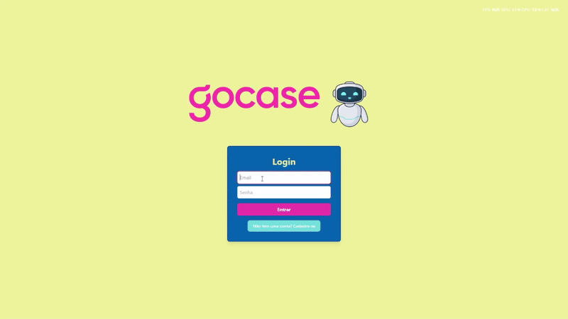
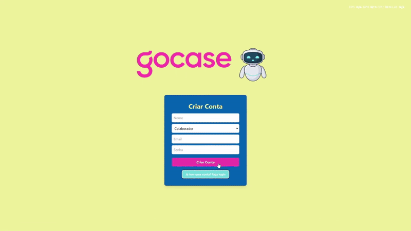

# Projeto IA.go Gocase

Esse é um projeto full-stack feito com um frontend em React+Vite+TS e um backend feito em Python+FastAPI.

## Objetivo

Este projeto tem como objetivo otimizar o processo de avaliação de desempenho na GoCase por meio da automação da elaboração dos Planos de Desenvolvimento Individual (PDI). Para isso, será desenvolvido um agente de Inteligência Artificial capaz de analisar dados essenciais, como feedbacks de gestores, autoavaliações de colaboradores e atas de avaliação de desempenho.

Com base nessa análise, a IA identificará os principais pontos fortes e áreas de melhoria de cada colaborador, sugerindo planos de ação personalizados de forma ágil e eficiente. Essa solução reduzirá o tempo necessário para a criação dos PDIs, permitindo que a empresa gere mais valor no processo de desenvolvimento profissional dos colaboradores.

## Tecnologias Usadas

- **Frontend:**
  - React
  - TypeScript
  - Vite
  - Tailwind CSS
- **Backend:**
  - Python
  - uv
  - FastAPI
  - SQLAlchemy
  - Alembic
  - SQLite
  - Langchain

## Estrutura do Projeto

O projeto está dividido em dois principais diretórios:

- `frontend`: Contém a aplicação frontend em React.
- `backend`: Contém a aplicação backend em FastAPI.

## Começando

Consulte os arquivos README individuais nos diretórios `frontend` e `backend` para obter instruções detalhadas sobre como configurar e executar cada parte da aplicação.

- [Frontend README](./frontend/README.md)
- [Backend README](./backend/README.md)

## Exemplos

### Criar conta para o colaborador:

### Criar conta para o líder:

