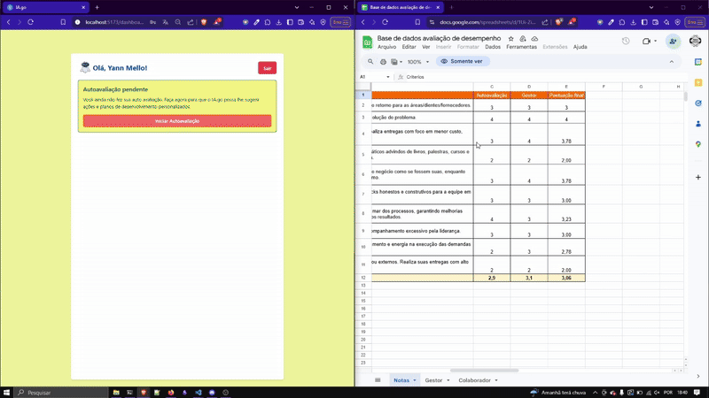
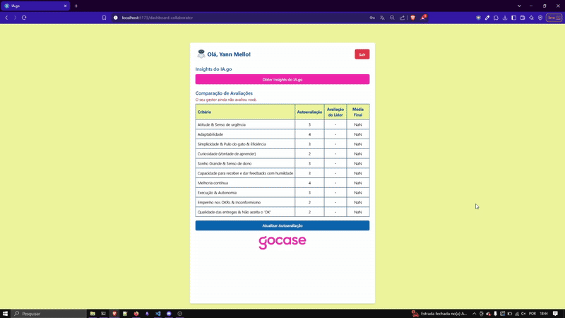

# Projeto IA.go Gocase

Esse é um projeto full-stack feito com um frontend em React+Vite+TS e um backend feito em Python+FastAPI.

## Objetivo

Este projeto tem como objetivo otimizar o processo de avaliação de desempenho na GoCase por meio da automação da elaboração dos Planos de Desenvolvimento Individual (PDI). Para isso, será desenvolvido um agente de Inteligência Artificial capaz de analisar dados essenciais, como feedbacks de gestores, autoavaliações de colaboradores e atas de avaliação de desempenho.

Com base nessa análise, a IA identificará os principais pontos fortes e áreas de melhoria de cada colaborador, sugerindo planos de ação personalizados de forma ágil e eficiente. Essa solução reduzirá o tempo necessário para a criação dos PDIs, permitindo que a empresa gere mais valor no processo de desenvolvimento profissional dos colaboradores.

## Tecnologias Usadas

- **Frontend:**
  - React
  - TypeScript
  - Vite
  - Tailwind CSS
- **Backend:**
  - Python
  - uv
  - FastAPI
  - SQLAlchemy
  - Alembic
  - SQLite
  - Langchain

## Estrutura do Projeto

O projeto está dividido em dois principais diretórios:

- `frontend`: Contém a aplicação frontend em React.
- `backend`: Contém a aplicação backend em FastAPI.

## Começando

Consulte os arquivos README individuais nos diretórios `frontend` e `backend` para obter instruções detalhadas sobre como configurar e executar cada parte da aplicação.

- [Frontend README](./frontend/README.md)
- [Backend README](./backend/README.md)

## Exemplos

**OBS:** Os dados preenchidos nos formulários de avaliação foram obtidos da [Base de dados avaliação de desempenho](https://docs.google.com/spreadsheets/d/1Ui-ZiT9S5730MGv3y8O-RZNeNb6kApNupmKo0Ze0kNM/edit?gid=1021057272#gid=1021057272) fornecida nas instruções do projeto.

### Criar conta para o colaborador:


### Criar conta para o líder:


### Fazer autoavaliação:



### Avaliação do gestor ao colaborador:


### PDI e Insights gerados pelo IA.go:



```text
Olá, Yann! 👋

Com base na sua autoavaliação e na avaliação do seu gestor, preparei algumas sugestões para o seu Plano de Desenvolvimento Individual (PDI). Lembre-se de que este é um guia para te ajudar a crescer e alcançar seus objetivos na GoCase. Compartilhe este plano com seu gestor para que ele possa te apoiar ainda mais!

1. Pontos Fortes:

Adaptabilidade (4.0): Sua capacidade de assimilar novas demandas e aprender no caminho é muito valiosa. Para potencializar essa habilidade, que tal se voluntariar para projetos desafiadores fora da sua área? Isso reforça o mantra "Faça Acontecer", pois você estará buscando ativamente oportunidades de crescimento e aprendizado.

2. Focos de Desenvolvimento:

Qualidade das entregas & Não aceita o "OK" (2.0):

O que fazer: Defina prazos realistas para suas tarefas, considerando possíveis imprevistos. Priorize as atividades mais importantes e urgentes.

Recurso: Utilize ferramentas de gestão de tempo, como o Trello ou Google Agenda, para organizar suas tarefas e prazos.

Indicador: Redução do tempo de entrega das tarefas em 15% no próximo ciclo.

Impacto: Aumentar a eficiência e a qualidade das entregas, garantindo a satisfação dos clientes internos e externos. Isso reforça o mantra "Trabalho Duro", pois você estará se dedicando a entregar resultados de alta qualidade dentro do prazo.


Curiosidade (Vontade de aprender) (2.0):

O que fazer: Reserve um tempo semanal para pesquisar e estudar temas relevantes para sua área e para a GoCase.

Recurso: Assine newsletters, siga blogs e participe de grupos de discussão online sobre temas relacionados ao seu trabalho. A Cumbuca é uma ótima ferramenta para isso!

Indicador: Apresentar pelo menos um insight relevante por semana nas reuniões de Daily do setor.

Impacto: Ampliar seus conhecimentos e trazer novas ideias para a equipe, contribuindo para a inovação e o crescimento da GoCase. Isso reforça o mantra "Time Campeão", pois você estará compartilhando seus conhecimentos com a equipe e contribuindo para o sucesso coletivo.


Empenho nos OKRs & Inconformismo (2.77):

O que fazer: Dedique um tempo para entender a fundo os OKRs da sua área e como suas tarefas contribuem para o alcance desses objetivos.

Recurso: Reúna-se com seu gestor para discutir os OKRs e alinhar suas expectativas.

Indicador: Atingir 100% das metas estabelecidas para os OKRs pelos quais você é responsável no próximo ciclo.

Impacto: Aumentar seu engajamento e senso de dono em relação aos objetivos da empresa, contribuindo para o sucesso da GoCase. Isso reforça o mantra "Sonho Grande & Senso de Dono", pois você estará se dedicando a alcançar os objetivos da empresa como se fossem seus.


3. Mensagem Final:


Yann, lembre-se de que seu crescimento é fundamental para o sucesso da GoCase. Ao investir em seu desenvolvimento, você estará contribuindo para a nossa missão de transformar ideias em objetos únicos e customizados que os Golovers usem para expressar seu estilo de vida. A GoCase valoriza quem "Faz Acontecer" e busca sempre a "Transparência Máxima". Use este PDI como um guia para alcançar seus objetivos e continue crescendo conosco!🚀
```

## Próximos Passos e Pontos de Melhoria:

- Tornar backend do projeto `async` para melhorar performance
- Escolher um banco de dados mais eficiente a concorrências em consultas. Ex: PostgreSQL
- Tratar melhor os erros.
- Adicionar observabilidade com Logs e Métricas
-
-
-
